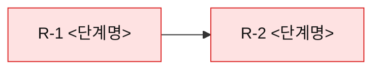

# 로드맵 (흐름도의 축)

> 한 줄 요지: <단계 흐름 요약>

```mermaid
flowchart LR
  R1["R-1 <단계명>"]:::todo --> R2["R-2 <단계명>"]:::todo
  classDef done fill:#dcfce7,stroke:#16a34a,color:#111111
  classDef wip fill:#fef9c3,stroke:#ca8a04,color:#111111
  classDef todo fill:#fee2e2,stroke:#dc2626,color:#111111
```

| 번호 | 단계 | 연결 목표 | 완료 기준 | 상태 |
|---|---|---|---|---|
| R-1 | <단계명> | G-1 | <완료 판단 기준> | 미착수 |

## 변경 이력
- <YYYY-MM-DD> <변경 내용과 사유>
